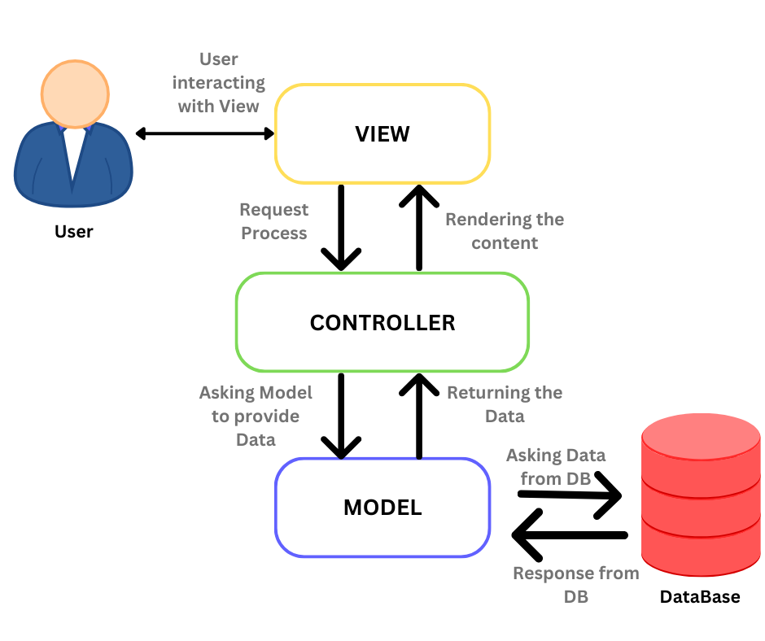

# GAMESCORING APP (Group 5)

# **Scoring Board**

The Simple Scoring App is a tool for tracking and displaying participant or team scores during sports, contests, and other activities. Its goal is to provide a simple, efficient, and user-friendly experience, allowing users to focus on the activity rather than manually keeping track of scores.

The app includes three main features: controlling the scoring system, ensuring the display updates accurately, and offering user-friendly controls for increasing and decreasing scores.

The scoring method maintains an exact count for every individual or team participating, guaranteeing a high degree of accuracy.


**MVC (Model, View, and Controller) Design Pattern Architeture**



## Table of Contents

- [Installation](#installation)
- [Usage](#Output)
- [Model](#Model)

## Installation

To install the required dependencies, run:


`pip install -r requirements.txt`


This will install Python 3.11 (if not already installed), PIL (Python Imaging Library), and pypubsub.

### Additional Setup

If you need to manually install any additional tools, please refer to the [Additional Setup](#additional-setup) section below.


' **MVC (Model, View, and Controller) pattern** for a **scoring board**. This application allows updating and displaying the score of a team in a game.

---

# **Model**
The `Score` class represents the data.
   - Stores the team name and the points scored.

## Overview
The `Actions` class implements the **Model** component of the MVC (Model-View-Controller) design pattern. It is responsible for managing application data and business logic related to a simple sports scoring application, supporting functionalities for basketball and soccer games.

## Class: Actions
The `Actions` class provides attributes and methods to:
1. Manage and update scores for teams.
2. Track the current game quarter for basketball.
3. Determine the winner for basketball and soccer games.
4. Implement a countdown timer.

```python
class Actions:
    def __init__(self):
        self.number1 = 0
        self.number2 = 0
        self.number3 = 0
        self.number4 = 0
        self.num = 0
        self.time_left = 1800  # 30 minutes in seconds
        self.update_timer = None
        self.quarter = 1
```

### Attributes:
- **number1 (int)**: Tracks the score for Team 1 in basketball.
- **number2 (int)**: Tracks the score for Team 2 in basketball.
- **number3 (int)**: Tracks the score for Team 3 in soccer.
- **number4 (int)**: Tracks the score for Team 4 in soccer.
- **num (int)**: A generic placeholder variable, unused in the current implementation.
- **time_left (int)**: Countdown timer in seconds (default: 1800 seconds, equivalent to 30 minutes).
- **update_timer (NoneType)**: Reserved for timer update logic (unused in current implementation).
- **quarter (int)**: Tracks the current quarter in a basketball game (default: 1, increments up to 4).

### Methods:
```python
    def clicked_1(self, increment_amount: int) -> int:
        self.number1 += increment_amount
        return self.number1
```
#### 1. clicked_1(increment_amount: int) -> int
Increases the score for **Team 1** in basketball by a specified amount.

**Parameters:**
- `increment_amount` (int): The value to add to Team 1's score.

**Returns:**
- Updated score for Team 1.

```python
    def clicked_2(self, num):
        self.number2 += num
        return self.number2
```

#### 2. clicked_2(num: int) -> int
Increases the score for **Team 2** in basketball by a specified amount.

**Parameters:**
- `num` (int): The value to add to Team 2's score.

**Returns:**
- Updated score for Team 2.

```python
    def soccerClicked_1(self,num):
        self.number3 += num
        return self.number3
```

#### 3. soccerClicked_1(num: int) -> int
Increases the score for **Team 3** in soccer by a specified amount.

**Parameters:**
- `num` (int): The value to add to Team 3's score.

**Returns:**
- Updated score for Team 3.

```python
    def soccerClicked_2(self,num):
        self.number4 += num
        return self.number4
```    

#### 4. soccerClicked_2(num: int) -> int
Increases the score for **Team 4** in soccer by a specified amount.

**Parameters:**
- `num` (int): The value to add to Team 4's score.

**Returns:**
- Updated score for Team 4.

``` python
      def quarterClicked(self,num):
        if self.quarter < 4:
            self.quarter += num
        return self.quarter
```

#### 5. quarterClicked(num: int) -> int
Increments the basketball game quarter by a specified amount. The quarter cannot exceed 4.

**Parameters:**
- `num` (int): The value to increment the quarter.

**Returns:**
- Updated quarter value.

``` python
    def get_winner_basketball(self):
        if self.number1 > self.number2:
            return "Team 1 wins"
        elif self.number2 > self.number1:
            return "Team 2 2 wins"
        else:
            return "It's a draw, we go overtime"
```

#### 6. get_winner_basketball() -> str
Determines the winner of the basketball game based on scores for Team 1 and Team 2.

**Returns:**
- A string indicating the winner or if the game is a draw.

```python
    def get_winner_soccer(self):
        if self.number3 > self.number4:
            return "Team 3 wins"
        elif self.number4 > self.number3:
            return "Team 4 wins"
        else:
            return "It's a draw, we go overtime"
```

#### 7. get_winner_soccer() -> str
Determines the winner of the soccer game based on scores for Team 3 and Team 4.

**Returns:**
- A string indicating the winner or if the game is a draw.

```python
    def countdown(self):
        if self.time_left > 0:
            return self.time_left - 1
        else:
            return None
```

#### 8. countdown() -> int | None
Decrements the countdown timer by one second. If the timer reaches zero, it stops.

**Returns:**
- Remaining time in seconds, or `None` if the timer has finished.

### Usage Example
```python
if __name__ == "__main__":
    app = Actions()
    print("Initial Team 2 Score:", app.clicked_2(9))
    print("Team 1 Score After Increment:", app.clicked_1(5))
    print("Basketball Winner:", app.get_winner_basketball())

    # Soccer game simulation
    app.soccerClicked_1(2)
    app.soccerClicked_2(3)
    print("Soccer Winner:", app.get_winner_soccer())

    # Timer countdown
    for _ in range(5):
        print("Time left:", app.countdown())
```


---

# **View**
The `ScoreView` class displays the score details.
   - Responsible for displaying the scoring board.

### Main Functionality of the `View` Class and Its Features

The `View` class serves as a graphical interface component for a scoring system integrated with a controller. It leverages the `tkinter` library for UI and manages multiple canvases for different sports and states of the application. Below are the documented features and functions:

#### Features:
- **Canvas Management:**
  - Dynamically creates, switches, and updates multiple canvases (`StartProgramCanvas`, `StartScreenCanvas`, `SoccerCanvas`, `BasketballCanvas`) for different states or sports.
  - Centralized storage of all canvases in a dictionary for seamless switching.

- **Widget Placement:**
  - Configures and arranges buttons, score labels, and other widgets across various canvases.
  - Dedicated methods for basketball (`button_place_basketball`) and soccer (`button_place_soccer`) screen layouts.

- **Score Management:**
  - Provides methods to update and reset scores for basketball and soccer.
  - Gracefully handles missing widgets with warnings instead of crashing.

- **Navigation:**
  - Allows switching between different canvases (`switch_canvas`) and updates layout dynamically.

- **Sport-Specific Features:**
  - Basketball:
    - Tracks quarters and scores for two teams.
    - Includes controls for resetting scores, ending games, and managing time.
  - Soccer:
    - Tracks scores for two teams with buttons for incrementing, decrementing, and resetting scores.

- **Reusability and Abstraction:**
  - Utilizes `ButtonAbstraction` for creating reusable and consistent buttons.
  - Supports modular addition of new features for other sports or states.

#### Key Methods:
- `__init__`: Initializes the class, sets up the container, canvases, and layout configuration.
- `setup`: Coordinates the creation and arrangement of all components, establishing the initial layout.
- `create_all_canvases`: Defines and organizes the various canvases used by the application.
- `switch_canvas`: Handles transitions between different canvases, including updating button layouts.
- `update_score_*` and `reset_scores_*`: Update or reset scores on the specified widgets for basketball or soccer.
- `create_start_screen_widgets`, `create_soccer_screen_widget`, `create_basketball_widgets`: Define the widgets for each sport or initial screen, including buttons and score displays.
- `button_place_*`: Defines the placement of buttons for specific sports.

This structure provides a robust and scalable way to manage scoring systems for multiple sports, with potential for expansion to additional games or features. Let me know if you'd like more details on specific methods or features.

**1. Imports and Constants**


    import os
    import tkinter as tk
    from pathlib import Path

    from modules.ButtonCreator import ButtonAbstraction
    from modules.Scores import create_score_text

Imports:
- os, Path: Used to manage file paths and resolve asset locations.

- tkinter: A Python GUI library for creating the graphical interface.

- ButtonAbstraction and create_score_text: External modules that handle button
creation and score display functionality.

    OUTPUT_PATH = Path(__file__).parent
    ASSETS_PATH = OUTPUT_PATH / Path(fr"{os.getcwd()}\assets\frame0")

Constants:

- OUTPUT_PATH: The directory where the script is located.
- ASSETS_PATH: The path to the assets used for the UI (e.g., button images).

**2. Class View Initialization**

    class View:
        def __init__(self, parent):
            self.all_canvases = {}
            self.container = parent
            self.current_canvas = None
            self.top_frame = None
            self.number1 = 0
            self.number2 = 0
            
Attributes:

- all_canvases: A dictionary to store all canvases by name for easy switching.

- container: The parent tkinter widget (likely the root window).

- current_canvas: Tracks the currently displayed canvas.

- number1, number2: Generic numeric variables, potentially for score tracking.

**3. Setup Methods**

    def setup(self):
        self.create_all_canvases()
        self.setup_layout()

Purpose: Orchestrates the initialization process by creating canvases and
arranging widgets.


**4. Canvas Creation and Management**


def create_all_canvases(self):

    self.SoccerCanvas = self.create_canvas("SoccerCanvas")
    self.BasketballCanvas = self.create_canvas("BasketballCanvas")
    self.StartScreenCanvas = self.create_canvas("StartScreenCanvas")
    self.StartProgramCanvas = self.create_canvas("StartProgramCanvas")

    self.create_start_program_widgets(self.StartProgramCanvas)
    self.create_start_screen_widgets(self.StartScreenCanvas)
    self.create_basketball_widgets(self.BasketballCanvas)
    self.create_soccer_screen_widget(self.SoccerCanvas)

    self.all_canvases["StartScreenCanvas"] = self.StartScreenCanvas
    self.all_canvases["BasketballCanvas"] = self.BasketballCanvas
    self.all_canvases["SoccerCanvas"] = self.SoccerCanvas
    self.all_canvases["StartProgramCanvas"] = self.StartProgramCanvas
    self.current_canvas = "StartProgramCanvas"

Purpose:

- Creates canvases for different application states (start screen, soccer, basketball).

- Calls widget-creation methods to populate each canvas.

- Registers canvases in a dictionary for easy reference.


    def create_canvas(self, canvas_name):

        canvas = tk.Canvas(
            self.container,
            bg="#F3F3F3",
            height=720,
            width=1280,
            bd=0,
            highlightthickness=0,
            relief="ridge"
        )
        return canvas


Purpose: Creates a blank Canvas widget with specified properties.


**5. Switching Between Canvases**


    def switch_canvas(self, canvas_name):

        if canvas_name not in self.all_canvases:
            print(f"Invalid canvas name: {canvas_name}")
            return

        if self.current_canvas:
            self.all_canvases[self.current_canvas].place_forget()

        self.all_canvases[canvas_name].place(x=0, y=0)
        self.update_button_layout()
        self.current_canvas = canvas_name

Purpose:

- Hides the currently active canvas and displays a new one.
- Validates canvas names to avoid errors.
- Updates the layout of buttons depending on the new canvas.

**6. Button Layout Management**

    def update_button_layout(self):
        if self.current_canvas == "StartScreenCanvas":
            self.button_1_1.place(x=589.0, y=599.0, width=102.0, height=72.0)
            self.button_1_2.place(x=73.0, y=156.0, width=532.0, height=430.0)
            self.button_1_3.place(x=652.0, y=156.0, width=532.0, height=430.0)
        elif self.current_canvas == "BasketballCanvas":
            self.button_place_basketball()
        elif self.current_canvas == "StartProgramCanvas":
            self.button_1_1.place(relx=0.5, rely=0.5, anchor='center')

Purpose: Adjusts button positions based on the active canvas.

**7. Widget Placement**

**For Basketball:**

    def create_basketball_widgets(self, BasketballCanvas):
        self.BasketballCanvas = BasketballCanvas
        self.score1, self.score2 = create_score_text(self.BasketballCanvas)

        self.BasketballCanvas.create_rectangle(...)
        self.BasketballCanvas.create_text(...)
        button_abstraction_1 = ButtonAbstraction(...)
        ...
        self.button_1 = button_abstraction_1.create_button()
        ...

Purpose: Creates and places basketball-specific widgets, including scores, buttons, and labels.

**For Soccer:**

    def create_soccer_screen_widget(self, SoccerCanvas):
        self.SoccerCanvas = SoccerCanvas
        self.score3, self.score4 = create_score_text(self.SoccerCanvas)

        self.SoccerCanvas.create_rectangle(...)
        self.SoccerCanvas.create_text(...)
        button_abstraction_1_1 = ButtonAbstraction(...)
        ...
        self.button_2_1 = button_abstraction_1_1.create_button()
        ...

Purpose: Similar to basketball, but for soccer-specific widgets.

**For Start Screen:**

    def create_start_screen_widgets(self, StartScreenCanvas):
        self.StartScreenCanvas = StartScreenCanvas
        self.StartScreenCanvas.create_text(...)
        button_abstraction_1_2 = ButtonAbstraction(...)
        self.button_1_2 = button_abstraction_1_2.create_button()
        ...

Purpose: Creates start screen widgets, such as text and sport-selection buttons.

**8. Score Management**

    def update_score_basketball(self, widget_id, value):
        try:
            self.BasketballCanvas.itemconfigure(widget_id, text=str(value))
        except AttributeError:
            print(f"Warning: Widget {widget_id} not found. Score not updated.")

Purpose: Updates basketball scores on the canvas.


    def reset_scores_basketball(self, widget_id1, widget_id2, value):
        try:
            self.BasketballCanvas.itemconfigure(widget_id1, text=str(value))
            self.BasketballCanvas.itemconfigure(widget_id2, text=str(value))
        except AttributeError:
            print(f"Warning: Widget {widget_id1,widget_id2} not found. Score not updated.")

Purpose: Resets basketball scores for both teams.
(Similar methods exist for soccer.)

**9. Main Program Execution**

    if __name__ == "__main__":
        root = tk.Tk()
        WIDTH, HEIGHT = 1280, 720
        root.geometry(f"{WIDTH}x{HEIGHT}")
        root.title("Game Controller")

        view = View(root)
        view.setup()
        root.mainloop()

Purpose:
- Initializes the tkinter root window.
- Creates a View instance and calls setup to display the interface.
- Enters the tkinter event loop (mainloop).

---

# **Controller**

The `ScoreController` class connects the model and the view.
  - Manages updates to the model and refreshes the view.

## Overview
This code implements a `ActionsController` class, responsible for managing the interactions between the **model**, **view**, and user input in a graphical user interface (GUI) application. The application seems to simulate scorekeeping for basketball and soccer games. It uses **Tkinter** for the GUI and **pubsub** for event handling.

#### **Dependencies**
- `tkinter`: GUI toolkit for rendering the application.
- `pubsub`: Library for implementing a publish-subscribe pattern.
- `modules.Model`: Custom module containing the `Actions` class (model logic).
- `modules.View`: Custom module containing the `View` class (view logic).


### **Class: ActionsController**

```python
class ActionsController:
    def __init__(self, parent):
        self.parent = parent
        self.model = Actions()
        self.view = View(parent)
        self.view.setup()
        self.update_timer = None       

````

#### **Attributes**
- `parent`: Reference to the root Tkinter object.
- `model`: Instance of the `Actions` class for handling game logic.
- `view`: Instance of the `View` class for managing GUI elements.
- `update_timer`: Placeholder for a timer object.

#### **Methods**

##### **1. `__init__(self, parent)`**
Initializes the controller, binds the model and view, and subscribes to various event topics using `pubsub`.

**Features:**
- Initializes model and view.
- Subscribes to events like score updates, resets, game starts, and ends.
- Logs success or failure of event subscriptions.

##### **2. Event Handlers**
These methods respond to specific events published via `pubsub`.

**a. `handle_quarter_time(self, message)`**
- Updates the basketball quarter on the GUI.
- Uses `message` to set the quarter number dynamically.

**b. `handle_start_program(self, message)`**
- Switches from the start program canvas to the start screen canvas.

**c. `handle_soccer_canvas(self, message)`**
- Determines and logs the winner of the soccer game.
- Resets soccer scores and switches back to the start screen canvas.

**d. `handle_endgame_canvas(self, message)`**
- Determines and logs the winner of the basketball game.
- Resets basketball scores and the quarter number.
- Switches back to the start screen canvas.

**e. `handle_startgame_canvas(self, message)`**
- Switches from the start screen canvas to either basketball or soccer canvas based on the message.

**f. `handle_score_update_1(self, message)`**
- Updates basketball Team 1's score.
- Parses `message` and passes the data to the `Actions` model.

**g. `handle_score_update_2(self, message)`**
- Updates basketball Team 2's score.

**h. `handle_score_update_3(self, message)`**
- Updates soccer Team 1's score.

**i. `handle_score_update_4(self, message)`**
- Updates soccer Team 2's score.

**j. `handle_reset_score_basketball(self, message)`**
- Resets basketball scores to 0 for both teams.
- Resets the basketball view scores.

**k. `handle_reset_score_soccer(self, message)`**
- Resets soccer scores to 0 for both teams.
- Resets the soccer view scores.

---

#### **Main Program**
If the file is executed directly:
- Creates a `Tkinter` root window with a specified size (1280x720).
- Initializes the `ActionsController` with the root window.
- Starts the Tkinter main loop to render the GUI.

---

#### **Features of the Application**
1. **Dynamic Event Handling**:
   - Uses `pubsub` to subscribe and handle multiple events for seamless communication between components.

2. **Separation of Concerns**:
   - The **model** (`Actions`): Manages the game logic.
   - The **view** (`View`): Manages GUI elements.
   - The **controller** (`ActionsController`): Acts as the bridge between the model and the view.

3. **Extensibility**:
   - Modular design makes it easy to add new game types, events, or features.

4. **Scalability**:
   - Event-based communication ensures scalability for larger applications.

5. **Customizable GUI**:
   - Uses `Tkinter` for a flexible, customizable interface.


---

# **Output**

### Start Program


